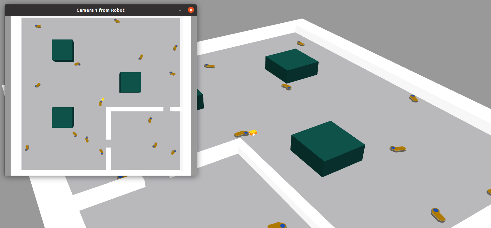

   

Репозиторий содержит программное обеспечение (шаблон ros-пакета) для сдачи задания категории _Магистратура_  направления Робототехники олимпиады [Я - Профессионал](https://yandex.ru/profi/courses2021).

Данное программное обеспечение, в исходном, предоставляемом участникам виде, будет использоваться для проведения оценки заданий участников.

Предоставляемое программное обеспечение включает:

* ROS-пакеты для симуляции мобильного робота и окружения внутри симулятора gazebo.

* Визуализацию симуляции в среде Gazebo.

Работа с пакетом предполагается из docker-контейнера, предоставляемого участникам в составе [основного репозитория олимпиады](https://gitlab.com/beerlab/iprofi2022/profi2022_robotics), соответственно, предоставляемые далее инструкции требуют предварительно выполнить инструкции, представленные в нем.

#### Установка программного обеспечения

1. В новом терминале вне docker-контейнера перейдите в корневую директорию основного репозитория олимпиады и склонируйте данный репозиторий в рабочее окружение выполнив:

        cd workspace/src
        git clone https://gitlab.com/beerlab/iprofi2022/profi2022_master_scene.git

3. Откройте bash-сессию **внутри контейнера**, перейдите в смонтированное рабочее окружение и соберите все пакеты:

        bash docker/into_docker.sh
        cd /workspace
        catkin build

#### Описание программного обеспечения

1. Для запуска симулятора в новой bash-сессии **внутри контейнера** запустите соответствующий launch-файл:

        roslaunch profi2022_master_solution solution.launch

   После запуска launch-файла на сцене в Gazebo появится комната.

   

2. Исходный код узла находится в <em>scripts/simple_move.py</em> [Python] и в <em>src/simple_move.cpp</em> [C++]. Узел подписывается на <a rel="nofollow noreferrer noopener" href="https://docs.ros.org/en/melodic/api/sensor_msgs/html/msg/Image.html">топик с изображением</a> с камеры робота <em>image_raw</em> и публикует желаемую скорость робота в <a rel="nofollow noreferrer noopener" href="http://docs.ros.org/en/jade/api/geometry_msgs/html/msg/Twist.html">топик <em>cmd_vel</em></a>.
